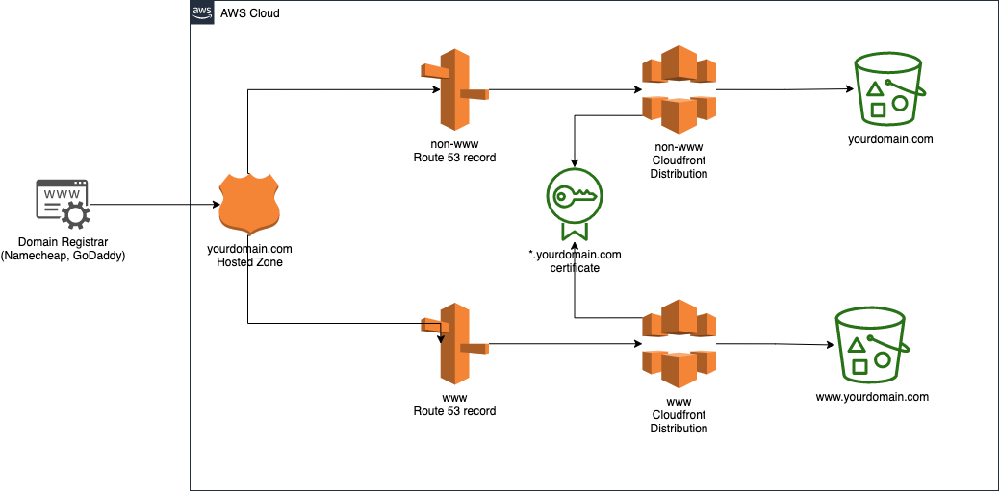

Title: Hosting a Secure Static Website on AWS S3 using Terraform
Slug: hosting-a-secure-static-website-on-aws-s3-using-terraform
Date: 2025-05-21 15:19
Tags: cloud, aws, staticwebsite
Category: Software, Cloud
Summary: In this article, we will cover how to create a static website on AWS using Terraform
Status: published
Header_Cover: images/posts/static-website-on-aws-s3/cover.jpg

By the time you finish reading this article, you will know how to get your static websites up and running securely on AWS using Terraform. This can be a very cost-effective way of hosting a website. I have 3 websites set up on AWS and in total, they cost me less than $5 a month.

### Prerequisites

Before we get started you are going to need so basics:

* Basic knowledge of Terraform
* Terraform v1.11.4 installed
* AWS CLI installed
* AWS Credentials correctly configured on your machine.
* A purchased domain, I buy mine from AWS.

I use awsume for switching between AWS accounts and it also sets up all the correct environment variables to work with Terraform. If you are on a Mac you can just use Homebrew to install what you need:

```
brew install terraform awscli awsume
```

### Aim for this Terraform project

I use the same set up for all my static websites. This is what we are looking to achieve:

* Secure website hosted at `https://www.yourdomain.com/` with a valid SSL certificate
* Requests to the insecure website `http://www.yourdomain.com/` are redirected to `https://www.yourdomain.com/`
* Requests without the www subdomain (`https://yourdomain.com/`) are redirected to `https://www.yourdomain.com/`
* Website set up with performance best practices to achieve a high score on [Google](https://developers.google.com/speed/pagespeed/insights/) [PageSpeed](https://developers.google.com/speed/pagespeed/insights/) and [GTMetrix](https://gtmetrix.com/)

### S3 Static Website Infrastructure

Hosting a static website on S3 only requires a few components, we don't even need anything complicated like VPCs or security groups to get this set up.

Once we are finished we are going to have the following components:

* S3 bucket that hosts our website files for our www subdomain
* S3 bucket that serves as the redirect to our www subdomain (I will explain later)
* SSL wildcard certificate validated for our domain that automatically renews.
* Cloudfront distribution for the www and non-www domain which is our CDN.
* Route 53 records pointed at to our Cloudfront distributions.




### Setting up our Terraform components

Now we are going to go through each of the files that make up our Terraform project with an explanation of what each of them are doing.

You might want to fork [my GitHub repo](https://github.com/tighov/tighov.link) and follow along with this tutorial.

### Creating a bucket to store state files

There is one bit of infrastructure that we are going to set up manually and that is the S3 bucket for storing the Terraform state files. You technically could set this up with another terraform script but then you would still need to store the state file for that as well.

In these examples, I have called this S3 bucket yourdomain-terraform. You will want to call yours something meaningful but as with all S3 buckets it needs to be globally unique.

Once created you can give it the following policy, making sure you update the account ID and bucket name.

```
{
  "Version": "2012-10-17",
  "Statement": [
    {
      "Effect": "Allow",
      "Principal": {
        "AWS": "arn:aws:iam::1234567890:root"
      },
      "Action": "s3:ListBucket",
      "Resource": "arn:aws:s3:::yourdomain-terraform"
    },
    {
      "Effect": "Allow",
      "Principal": {
        "AWS": "arn:aws:iam::1234567890:root"
      },
      "Action": ["s3:GetObject", "s3:PutObject"],
      "Resource": "arn:aws:s3:::yourdomain-terraform/*"
    }
  ]
}
```
Feel free to change the AWS principal to restrict access to another user or group.

### providers.tf

Terraform needs plugins called providers to interact with remote systems. In this case, we are only dealing with AWS but Terraform can also interact with other cloud services such as Azure and Google Cloud.

This also acts as the main file for the Terraform configuration such as where to store our state files

```
terraform {
  required_version = "~> 0.14"

  required_providers {
    aws = {
      source  = "hashicorp/aws"
      version = "~> 3.0"
    }
  }

  backend "s3" {
    bucket = "yourdomain-terraform"
    key    = "prod/terraform.tfstate"
    region = "eu-west-1"
  }
}

provider "aws" {
  region = "eu-west-1"
}

provider "aws" {
  alias  = "acm_provider"
  region = "us-east-1"
}
```

Here we are specifying the version of Terraform that we are using as well as the version of the AWS provider. This is to ensure that any future breaking changes to Terraform or the AWS provider does not stop our scripts from working.

The backend block specifies where your state file is going to be stored. The bucket should match that name of the bucket you created in the last step.

I have set up 2 providers here. The first AWS provider is the default provider (as it has no alias), this is what will be using for the majority of our components.

The second AWS provider is specifically for the SSL certificate. These need to be created in us-east-1 for Cloudfront to be able to use them.

In this example I am creating everything in EU Ireland eu-west-1, make sure you update this for your targeted region.

### variables.tf

In this file, we define the variables that we are going to use. In this project, we only need 3 domain_name, bucket_name and common_tags.

```
variable "domain_name" {
  type        = string
  description = "The domain name for the website."
}

variable "bucket_name" {
  type        = string
  description = "The name of the bucket without the www. prefix. Normally domain_name."
}

variable "common_tags" {
  description = "Common tags you want applied to all components."
}
```
We are going to use these 3 variables throughout the project.

### terraform.tfvars

The tfvars file is used to specify variable values. These will need to be updated for your domain.

```
domain_name = "yourdomain.com"
bucket_name = "yourdomain.com"

common_tags = {
  Project = "yourdomain"
}
```

The common_tags will be added to all the resources we are creating. This is useful to distinguish the cost of projects in billing reports.

### s3.tf

In this file, we are going to set up our S3 buckets. Technically you can put all the Terraform configuration in one file but I like to separate them into different components, it is just clearer this way.

```
# S3 bucket for website.
resource "aws_s3_bucket" "www_bucket" {
  bucket = "www.${var.bucket_name}"
  acl    = "public-read"
  policy = templatefile("templates/s3-policy.json", { bucket = "www.${var.bucket_name}" })

  cors_rule {
    allowed_headers = ["Authorization", "Content-Length"]
    allowed_methods = ["GET", "POST"]
    allowed_origins = ["https://www.${var.domain_name}"]
    max_age_seconds = 3000
  }

  website {
    index_document = "index.html"
    error_document = "404.html"
  }

  tags = var.common_tags
}

# S3 bucket for redirecting non-www to www.
resource "aws_s3_bucket" "root_bucket" {
  bucket = var.bucket_name
  acl    = "public-read"
  policy = templatefile("templates/s3-policy.json", { bucket = var.bucket_name })

  website {
    redirect_all_requests_to = "https://www.${var.domain_name}"
  }

  tags = var.common_tags
}
```

The first S3 bucket is where we are going to host all our website files. At a minimum, you will need to upload an index.html and a 404.html file in this bucket once it has been created.

The CORS settings are required so that the content length of our files are sent to Cloudfront. Without this, not all our files will have gzip compression and will result in lower scores on [Google](https://developers.google.com/speed/pagespeed/insights/) [PageSpeed](https://developers.google.com/speed/pagespeed/insights/) and [GTMetrix](https://gtmetrix.com/)

The second S3 bucket is going to redirect any requests to the www version of your website.

The template file mentioned gives read access to the bucket:

```
{
  "Version": "2012-10-17",
  "Statement": [
    {
      "Sid": "PublicReadGetObject",
      "Effect": "Allow",
      "Principal": "*",
      "Action": "s3:GetObject",
      "Resource": "arn:aws:s3:::${bucket}/*"
    }
  ]
}
```

### acm.tf

Next, we need to set up our SSL certificate. I have gone with email validation in this setup as it is by far the quickest method. When the certificate has been created by Terraform, AWS will send an email to the owner of the domain to approve the certificate request. The Terraform script will not complete until this has been done.

Alternatively, I have left the code for DNS validation which can be uncommented if you don't have email set up.

DNS validation requires the domain nameservers to already be pointing to AWS. However, you won't know the nameservers you need until after the NS Route 53 record has been created.

Alternatively, you can follow the validation instructions from the ACM page for your domain and apply them to where your nameservers are currently hosted. DNS validation can take 30 minutes or more during which the Terraform script will still be running.

```
# SSL Certificate
resource "aws_acm_certificate" "ssl_certificate" {
  provider                  = aws.acm_provider
  domain_name               = var.domain_name
  subject_alternative_names = ["*.${var.domain_name}"]
  validation_method         = "EMAIL"
  #validation_method         = "DNS"

  tags = var.common_tags

  lifecycle {
    create_before_destroy = true
  }
}

# Uncomment the validation_record_fqdns line if you do DNS validation instead of Email.
resource "aws_acm_certificate_validation" "cert_validation" {
  provider        = aws.acm_provider
  certificate_arn = aws_acm_certificate.ssl_certificate.arn
  #validation_record_fqdns = [for record in aws_route53_record.cert_validation : record.fqdn]
}
```

You can see in the above script that I am using the acm_provider as we need the certificate to be created in us-east-1 for Cloudfront to be able to use it.

### cloudfront.tf 

Now that we have done the S3 and SSL certificate we can look at creating the Cloudfront distributions. We need to create 2, one for each S3 bucket.

```
# Cloudfront distribution for main s3 site.
resource "aws_cloudfront_distribution" "www_s3_distribution" {
  origin {
    domain_name = aws_s3_bucket.www_bucket.website_endpoint
    origin_id   = "S3-www.${var.bucket_name}"

    custom_origin_config {
      http_port              = 80
      https_port             = 443
      origin_protocol_policy = "http-only"
      origin_ssl_protocols   = ["TLSv1", "TLSv1.1", "TLSv1.2"]
    }
  }

  enabled             = true
  is_ipv6_enabled     = true
  default_root_object = "index.html"

  aliases = ["www.${var.domain_name}"]

  custom_error_response {
    error_caching_min_ttl = 0
    error_code            = 404
    response_code         = 200
    response_page_path    = "/404.html"
  }

  default_cache_behavior {
    allowed_methods  = ["GET", "HEAD"]
    cached_methods   = ["GET", "HEAD"]
    target_origin_id = "S3-www.${var.bucket_name}"

    forwarded_values {
      query_string = false

      cookies {
        forward = "none"
      }
    }

    viewer_protocol_policy = "redirect-to-https"
    min_ttl                = 31536000
    default_ttl            = 31536000
    max_ttl                = 31536000
    compress               = true
  }

  restrictions {
    geo_restriction {
      restriction_type = "none"
    }
  }

  viewer_certificate {
    acm_certificate_arn      = aws_acm_certificate_validation.cert_validation.certificate_arn
    ssl_support_method       = "sni-only"
    minimum_protocol_version = "TLSv1.1_2016"
  }

  tags = var.common_tags
}

# Cloudfront S3 for redirect to www.
resource "aws_cloudfront_distribution" "root_s3_distribution" {
  origin {
    domain_name = aws_s3_bucket.root_bucket.website_endpoint
    origin_id   = "S3-.${var.bucket_name}"
    custom_origin_config {
      http_port              = 80
      https_port             = 443
      origin_protocol_policy = "http-only"
      origin_ssl_protocols   = ["TLSv1", "TLSv1.1", "TLSv1.2"]
    }
  }

  enabled         = true
  is_ipv6_enabled = true

  aliases = [var.domain_name]

  default_cache_behavior {
    allowed_methods  = ["GET", "HEAD"]
    cached_methods   = ["GET", "HEAD"]
    target_origin_id = "S3-.${var.bucket_name}"

    forwarded_values {
      query_string = true

      cookies {
        forward = "none"
      }

      headers = ["Origin"]
    }

    viewer_protocol_policy = "allow-all"
    min_ttl                = 0
    default_ttl            = 86400
    max_ttl                = 31536000
  }

  restrictions {
    geo_restriction {
      restriction_type = "none"
    }
  }

  viewer_certificate {
    acm_certificate_arn      = aws_acm_certificate_validation.cert_validation.certificate_arn
    ssl_support_method       = "sni-only"
    minimum_protocol_version = "TLSv1.1_2016"
  }

  tags = var.common_tags
}
```

The first one is our main distribution for our www bucket and has compression enabled and the max cache time enabled. Any HTTP requests to this distribution will be redirected to HTTPS automatically.

The second distribution has little caching as it all it does is point to the S3 bucket that redirects to our www website.

### route53.tf

Last but not least we need to create the route 53 records. The code below assumes you don't already have a hosted zone set up for this domain.

```
resource "aws_route53_zone" "main" {
  name = var.domain_name
  tags = var.common_tags
}

resource "aws_route53_record" "root-a" {
  zone_id = aws_route53_zone.main.zone_id
  name    = var.domain_name
  type    = "A"

  alias {
    name                   = aws_cloudfront_distribution.root_s3_distribution.domain_name
    zone_id                = aws_cloudfront_distribution.root_s3_distribution.hosted_zone_id
    evaluate_target_health = false
  }
}

resource "aws_route53_record" "www-a" {
  zone_id = aws_route53_zone.main.zone_id
  name    = "www.${var.domain_name}"
  type    = "A"

  alias {
    name                   = aws_cloudfront_distribution.www_s3_distribution.domain_name
    zone_id                = aws_cloudfront_distribution.www_s3_distribution.hosted_zone_id
    evaluate_target_health = false
  }
}
```

It is pretty clear what his file is doing, it simply sets up a record for www and non-www and points it to the respective Cloudfront distributions.


### Terraform command to deploy our infrastructure

With everything set up all we need to do now is to run the commands to deploy our infrastructure. You need to make sure your computer is set up with all the correct AWS credentials for these commands to work, I use [awsume](https://awsu.me/) for this.

```
terraform init
```

This is going to install our providers and any other plugins we are using.

```
terraform plan
```

This will show us what infrastructure has changed and what will be added.

```
terraform apply
```

Finally, this command will run the plan and you will be prompted to type yes to apply the changes.

During this process, you will be sent an email by AWS (probably to your equivalent of webmaster@yourdomain.com) to validate your AWS certificate. You need to do this otherwise your Terraform won't complete.

Once your www S3 bucket has been created you will also need to upload your website files. You can do this using the AWS CLI. Just cd to the directory containing your files and run:


```
aws s3 sync . s3://www.yourdomain.com
```

This will upload the contents of the directory to your S3 bucket. Whenever you make changes to the files in your S3 bucket you need to invalidate the Cloudfront cache.

```
aws cloudfront create-invalidation --distribution-id E3EDVELPIKTLHJ --paths "/*";
```

Where E3EDVELPIKTLHJ is the Cloudfront ID associated with your www S3 bucket.

If you are using AWS CLI V2, it is worth adding export AWS_PAGER="" (Linux and Mac) or setx AWS_PAGER "" (Windows) to the front of this command so that you don't need to manually exit the command after running. This is a slightly [annoying breaking change](https://docs.aws.amazon.com/cli/latest/userguide/cliv2-migration.html#cliv2-migration-output-pager) that the AWS team added.

Lastly, you need to point your domain nameservers to use the AWS nameservers. You will find these in the NS record of your hosted zone in the AWS console.

It can take 24 - 48 hours for DNS changes to propagate but I usually find things are working after 5 minutes. It likely depends on who your domain registrar is. I am using Namecheap (affiliate link) for all of mine.
