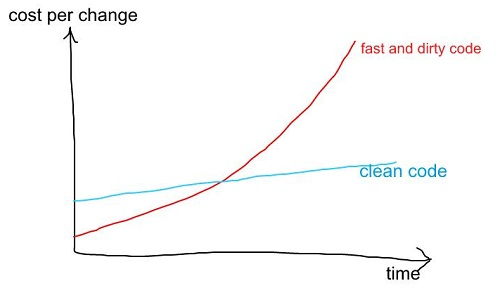

Title: Clean Code
Slug: clean-code
Date: 2019-06-03 21:01
Tags: sw-arch
Category: Software, Design
Summary: In this blog post I talk about clean code and some quick tips to help in daily life of a software developer
Status: published
Header_Cover: images/posts/clean-code/cover.jpg

#### Why clean code is important

Over the years I've learnt something that I want to share with you. Some of us code in C++, Python, bash, Scala, GO etc and these are very different languages. But there are some techniques and approacehes that really apply across languages and in this brown bag I am going to talk about these.

> So that might sound nice "_Clean Code_". But "_I have a deadline, I don't have time for clean code..._"
>

So in software development we run into deadline pressure. Our project manager is telling us that we have to get this done by end of the sprint. We are working hard, and the common outcome of this is the big ball of mud code. The fast and dirty code, to get something done. We are asked to go faster, but what happens is, we actually end up going slower. There are more bugs we have to go back and fix. We are finding needles in haystacks. Getting the work done actually takes longer than if we would written clean code to begin with slowly. A ounce of prevention is worth a pound of cure



> "The ratio of time spent reading code versus writing is well over 10 to 1.__ ."
>

So how do we know this? There have actually beem studies done, watching actually programmers work, how they are spending their time. Poeple are actually spending most of their time scrolling up and down in a file, looking for something. "No it's not theyre..." Open another file "Oh it's not there eirther. Where is this thing I'm trying to fix?" The actual time we spend typing, is a lot less than the time we spend just looking around. So if we take the time to make our code easy to read, we will make the code easier to write. This is a great quot:

> "We like to think we spend our time power typng, but we actually spend most of our time staring into the abyss."
>
> -- <cite>Douglas Crockford, principal discoverer of JSON, creator of JSLint</cite>

This is what I was just talking about. We're spending a lot of our time fighting the messy code. So with that as an explanation as to why it's important,
I want to show  quick tips for making our code clean.

#### Tips

##### We are responsible for the quality of our code

Not our scrum masters, not our project managers. If we think about other professions like doctors, layers and accountants, they all have professional standards that they adhere to. we don't go to the doctor and say "you know what doc, I'm in a hurry why don't you just skip washing your hands." We don't go to our accountant and say "Why don't you just skip the double entry bookkeeping? Why are you bothring with that let's do quick?" We have certain respect for people in these professions and respect how they work. So if we want to be treated as peofessionals we have to act like professionas. We have to be advocates for the quality of the code that we write. And advocate for doing it the right way and not accept the option to do it the wrong way. It's up to us to define what these professional standards are and it's not up to our clients nor our project managers.

##### Use meaningful names

When we are writig our code we should use meaningful names.

> Clean code should read like well written prose.
>
> -- <cite>Grady Booch</cite>

For example with variables.

```sh
d; // elapsed time in days
```

This is an example of a variable name that is not very good. `d` what does that mean? We have a little comment, it tells us what it does, but once we start getting into the code, we are looking at all these variables with all these cryptic names. The mental translating we have to do going back and forth between some cryptic symbol and its actual meaning starts to get in our way of actually understanding the work we're trying to do. So here are some better names that actually tell us what the variable does.

```sh
elapsed_time_in days;
daysSinceCreation;
days_since_modification;
```

So if we look at variable names like this, those are nouns in our prose.

##### Write code that expresses intent

The verbs in our prose are our functions and our methods. The idea here is that we have method names, just like our variable names, that clearly explain what it's for. As we read the code, we can sort of understand, what it's doing without even knowing the context. We can get a sense of what's going on, and we can do that without comments. So this will be kind of controversial comment on comments:

> "Comments are often lies waiting to happen. Code should speak for itsef whenever possible"
>

So what I mean by this? Often, we write comments because the intention of the code isn't clear. So we think "okay let's write a comment that will explain it". But when we create the comment we've now written something else that we have to maintain in addition to the code. What often happens, once people are working on a project they come in, they fix a bug, they update the code, maybe don't notice the comment, now the comment is wrong, and now its a lie, and it's going to take a future developer down the wrong path. I'm not saying never write comments. Often they are important for example if we're dealing with like a third party API need to explain some behaviour we know we can't necessarily do that in the code. So there are actually good cases for writing comments. I'm not saying never use them. What I am saying is when we're about to write a comment step back and think for a moment and think, you know, can I write code that expresses itself a little better and then baybe I don't have to write a comment.

##### Boy Scout Rule

> Always leave code cleaner than you found it!
>

The boy scout rule, in case of code, is leave the code better than we found. The boy scouts leave the campsite better than they found it. So not only I am saying we should write clean code but if we're working on some exiting code, take a few minutes and look at the surroundig code. __"Can I improve a variable name? Can I breake up a method that's too big?"__ So instead of the common scenario where code just gets messier and messier over time, we can instead have code that gets cleaner and cleaner over time. This is possible and I've worked with people who have done it and its a great way to work.

##### The Single Responsibility Principle

This is one of five principles created by as Bob Martin, who actually wrote the book Clean Code. So Single Responsiblity principle is the idea when we are talking about say a function or method, that it does one thing, it does it well, and it does it only. So what do we mean by that? A good way to think about it is if we're passing four or five arguments to a function that's probably doing more than one thing. If we think about all those arguments, we are now creating a matrix of possible outcomes that can be quite large and hard to debug, because there's so many things going on inside it. So that's a good way of getting familiar with this principle.
When it comes to methods with classes, what we're looking for is what's called __cohesiveness__.
The idea is, most of the methods in the class are using most of the properties. If we have one subset of methods using half the properties and another subset of methods using the other half we are probably doing more than one thing in that class. Maybe it actually neesds to be two classes so they each have a clear conceptual responsibility. Its clear what they're doing when they have one responsiblity as opposed to many.

##### Write Tests

> "This code worked the other day"
>

There are really 2 kinds of tests. One type is called __integration tests__ which actually test the functionality, how a user will experience our code. These have saved us so many times when we have changed something over here and we have run the test and found what it broke something over there. It's much better if we find it with our tests than we figure out it after depoymen or an angry customer finding it two weeks later.

They are also __unit tests__, which test our functionality in isolation. Test driven development is a great way to do this when we first come up with a test and then write our code to pass the test. It leads to better design.

##### Independent Architecture

> "Software architectures are structures that support the use cases of the system...
>
> Frameworks are tools to be used, not architectures to be conformed to.
>
> -- <cite>Bob Martin</cite>

So what is he talking about here? We can take a framework, so we can say that framework is a tool to be used not an architecture to be confromed to. The idea here is that there are good practices that can be applied across different frameworks and languages. So for example some plugins that we have written should be very clear from looking at the files and the variable names what functionality this plugin implements. We should be able, with a few changes take it outside of the framework and use it. Our connections to the framework aren't any greater than they need to be.

So the use cases are clear in the plugin for example it's not sort of yelling at us that it is a plugin it is yelling at us that it is a photo rating service or something like that.

##### Practice, practice, practice

Musicians don't only play when they are on stage in front of an audience. Really the same applies to programming. We should do codeing, POCs, learn new techniques when we are not performing for customer. That's a way we can really improve our skills.
